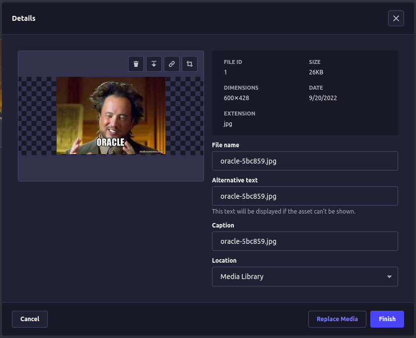

# Modifying Upload package Admin Panel

This is a simple example using patch-package to modify the Admin Panel of the Upload plugin. We are simply adding a file ID to the asset edit component.

Steps to reproduce in your own project:

1. Setup [patch-package](https://www.npmjs.com/package/patch-package), remember if you are a yarn user you also need `postinstall-postinstall` to run the patch after install.
2. Go edit `node_modules/@strapi/plugin-upload/admin/src/components/EditAssetDialog/index.js` Specifically around line 196 to add the new field.

Example for this field:

```js
{
  label: formatMessage({
    id: getTrad('modal.file-details.id'),
    defaultMessage: 'File ID',
  }),
  value: asset.id,
},
```

3. Use `npx patch-package @strapi/plugin-upload` to create the patch file.
4. See that you have a new patch file such as the one located in this repo [here](./patches/%40strapi%2Bplugin-upload%2B4.3.8.patch)
5. Make sure you run `yarn build` or `npm run build` to rebuild the admin panel.
6. Finally you should see something similar to the image below:


